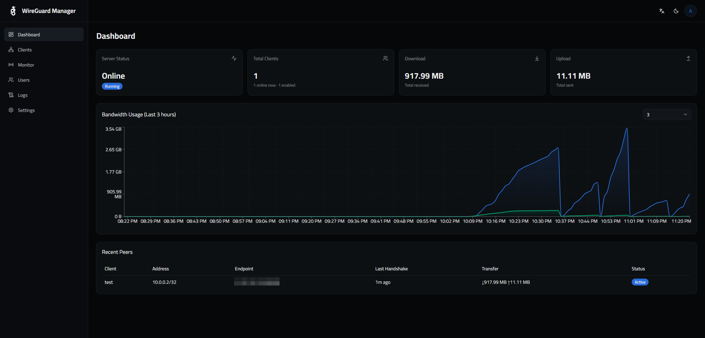

# WireGuard Manager

Self-hosted web interface to manage WireGuard VPN server. Built using Next.js, SQLite and Docker.





## Overview

WireGuard Manager is a web application for managing a WireGuard server where one can create/edit/enable/disable/delete clients, monitor connections with statistics of traffic usage and manage user accounts. The app runs together with the WireGuard service within a single Docker container and uses SQLite for state storage.

## Features

- Create/modify/delete/enable/disable clients.
- Download client configuration file as a .conf file and display QR code for smartphone clients.
- Real-time connection monitoring and visualization of traffic usage.
- Event log of connection events
- Support for multiple users, where there are 3 different roles: `super_admin`, `admin`, `auditor`.
- Account lock out feature on the login page after multiple attempts (brute-force protection).
- OpenIdConnect / Single Sign-On integration which supports any compliant OpenID Connect provider, for example, Keycloak, Azure Active Directory, Okta and others.
- Fallback to a local user management mechanism which works on `/login/local`.
- Importing existing clients from already existing `wg0.conf` via Settings page.
- Client private keys encryption with AES-256-GCM.
- Light/Dark themes and English/Arabic locales


## Requirements
- Docker and Docker Compose

## Deployment

**1. Clone the repository**

```bash
git clone <repo-url>
cd oc-wireguardUI
```

**2. Create the environment file**

```bash
cp .env.example .env
```

Edit `.env` and set the required values:

```
NEXTAUTH_SECRET=<random string>
NEXTAUTH_URL=http://<your-server-ip>:3123 # or domain 
ENCRYPTION_KEY=<32-character hex key>
WG_SERVER_HOST=<public IP or domain - use "auto" to detect automatically>
```

You can generate secure values with:

```bash
openssl rand -hex 32   # use for NEXTAUTH_SECRET and ENCRYPTION_KEY
```

**3. Start the container**

```bash
docker compose up -d
```

On the first run, a default admin account is created. The credentials are printed to the container logs:

```bash
docker compose logs wireguard | grep -A3 "Default admin"
```

Change the default password immediately after the first login by using the following command:
```bash
docker exec -it wireguard-manager wgm-cli user passwd user@example.com
```

## Environment Variables

| Property Name | Mandatory? | Details |
|---|---|---|
| `NEXTAUTH_SECRET` | Yes | Secret for signing session tokens |
| `NEXTAUTH_URL` | Yes | Public URL of the UI (OAuth callbacks) |
| `ENCRYPTION_KEY` | Yes (Prod) | 32-byte hex for encryption of private keys at rest |
| `WG_SERVER_HOST` | No | Public IP/domain in the client configurations (auto = detect) |
| `DATABASE_URL` | No | Connection string for the SQLite database (default: file:/data/app.db) |
| `WG_CONFIG_PATH` | No | The WireGuard config path (default: /etc/wireguard/wg0.conf) |

## CLI - User Management

The container contains a command-line tool (`wgm-cli`) for managing users accounts through the command line without entering the web UI.

```bash
# Show all existing users
docker exec -it wireguard-manager wgm-cli user list

# Create a new user (prompt for information)
docker exec -it wireguard-manager wgm-cli user create

# Change the user's password
docker exec -it wireguard-manager wgm-cli user passwd user@example.com

# Remove a user
docker exec -it wireguard-manager wgm-cli user delete user@example.com
```

## SSO / OIDC

The OIDC-based authentication can be enabled under **Settings → SSO / OIDC** from the web interface. The configuration is applied instantly without need to restart the server.

Add the following redirect URL in your identity provider:

```
https://<your-domain>/api/auth/sso/callback
```

Local user authentication will still work from the URL `/login/local` even when SSO is enabled.

## Data Storage

There are two places where data can be stored:

- `/etc/wireguard`: bound mount from the host machine; stores `wg0.conf` and WireGuard keys.
- `ui-data:/data`: Docker named volume; stores the SQLite database.

It is enough to back up these two places in order to recover the entire system state.

## License

MIT
